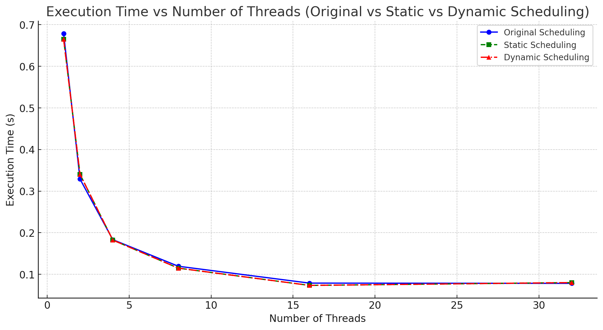
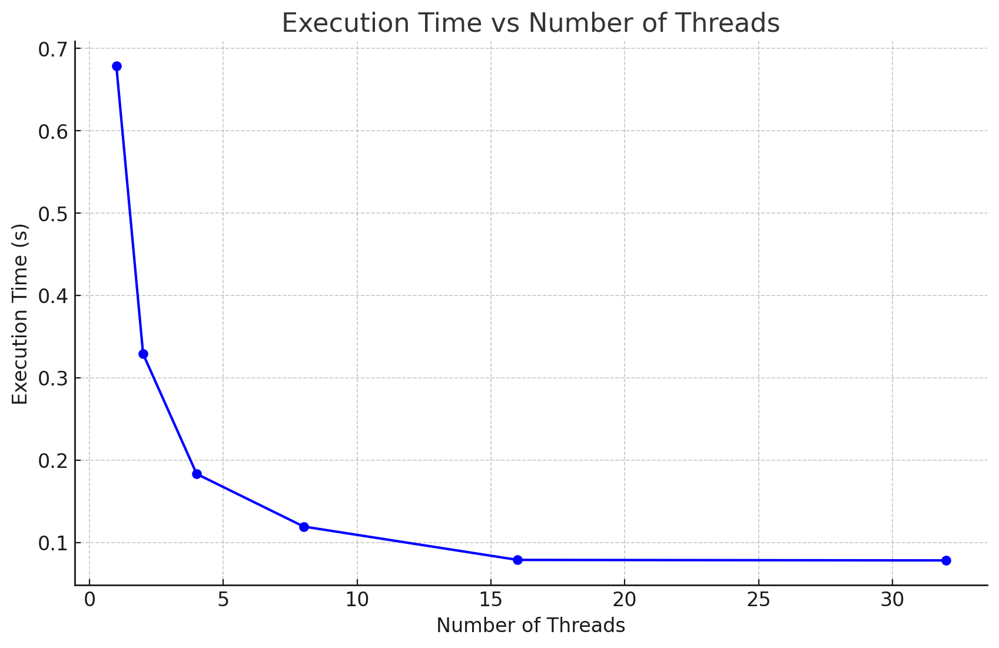
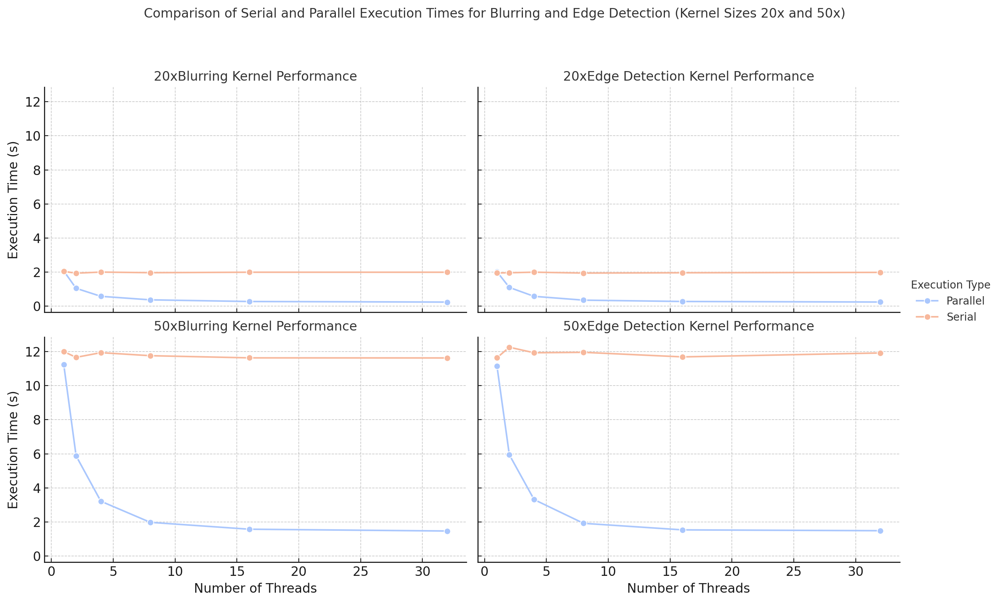
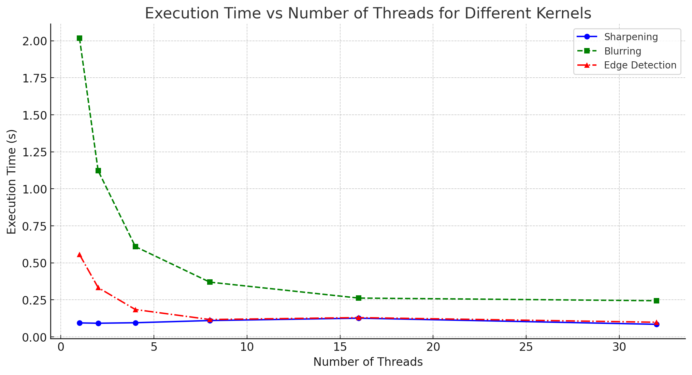
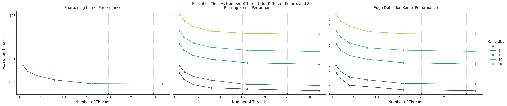

# Image Processing

## Convolution Scalability
_Ensuring that the convolution operation correctly handles different kernel sizes and that the code runs efficiently in parallel._

1. Implemented modular kernel retrieval with varied kernel sizes for testing.
2. Optimized kernel application with `simd` directive from OpenMP

## Scheduling
_Experiment with different OpenMP scheduling strategies (e.g., static, dynamic, guided)_

Having experimented with implementing the static/dynamic and guided schedules, they had proven to shown
very little difference in performence speed up:

## Threading
I have additionally created a simple benchmarking script to test how the nubmer of cores will impact the time, here is a graph:
(_made by ChatGPT by using the shell output of the benchmarking program_)

Note: subject to the processing power of the computer. This was tested with the following specs:

CPU: 13th Gen Intel(R) Core(TM) i7-13700HX

RAM: 32GB

### Serial
Now if we take away the parallization, we can see the benefit of using it.

Here we can see the most significant impact of using parallelization, especially when we scale size of the kernel,
at 50x50 kernel sizes, we can see the most significant improvement in performance when using parallelization.

## Kernels

| Edges | Bluring             |
|-|---------------------|
|  |  |

_Make different kernel versions_

1. Added a blur kernel or size $20$ for the sake of testing performence
2. Added a dynamic & scalable edge detection kernel that can be adapted to various sizesAdded a dynamic & scalable edge detection kernel that can be adapted to various sizes

## Overall Performance

Lets talk about this graph: For Blurring, the significant initial speedup matches what we expect from **Amdahls Law** when P is large, indicating that a substantial portion of the computation benefits from parallelization.
For Sharpening and Edge Detection we have a slightly different situation. We can observe a slight increase (might be subject to testing environment) however, assuming consistent behavior such as this the overhead  aligns with the overhead costs where more threads do not mean more speed.

### Kernel Size Variation
Until now we have held the kernel size fixed, its time to change that (except for sharpening since its a fixed assignment kernel):

- Sharpening: Shows minimal variation in execution time across thread counts, indicating that the workload is light and limited by thread management overhead.
- Blurring: The execution time decreases significantly with more threads, especially for larger kernel sizes (e.g., 20, 50). This demonstrates that larger workloads benefit more from parallel processing.
- Edge Detection: Similar to blurring, the performance improves as the number of threads increases, especially for larger kernel sizes.

---
AI Use Acknowledgment: ChatGPT was used to create performance graphs presented in the report.